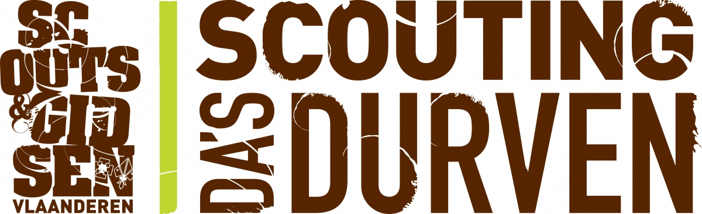

    <a href="Gedragscode.md">Gedragscode</a>&nbsp;&nbsp;&nbsp;
    <a href="Contributie.md">Project toevoegen</a>&nbsp;&nbsp;&nbsp;

 

## Over lokale projecten 

Een lijst met leuke intressante lokale IT projecten. Van personen en of groepen. 
Deze projecten hebben we opgesplitst per gouw. Om het overzichtelijk te houden. 

## Projecten 

| Autheur/Groep   | Link naar project |
| --------------- | ----------------- |
| Scouts en Gidsen Vlaanderen | [Groepsadmin-client](https://github.com/ScoutsGidsenVL/groepsadmin-client) | 
| Frederick Eskensn | [Totem App](https://github.com/ScoutsGidsenVL/Totemapp) |
| Tim Van Laer | [HO-Gids](https://github.com/ScoutsGidsenVL/ho-gids) | 
| Bram Scheerder | [Font Scouts en Gidsen Vlaanderen](https://github.com/BramScheerder/FontScoutsEnGidsenVlaanderen) |